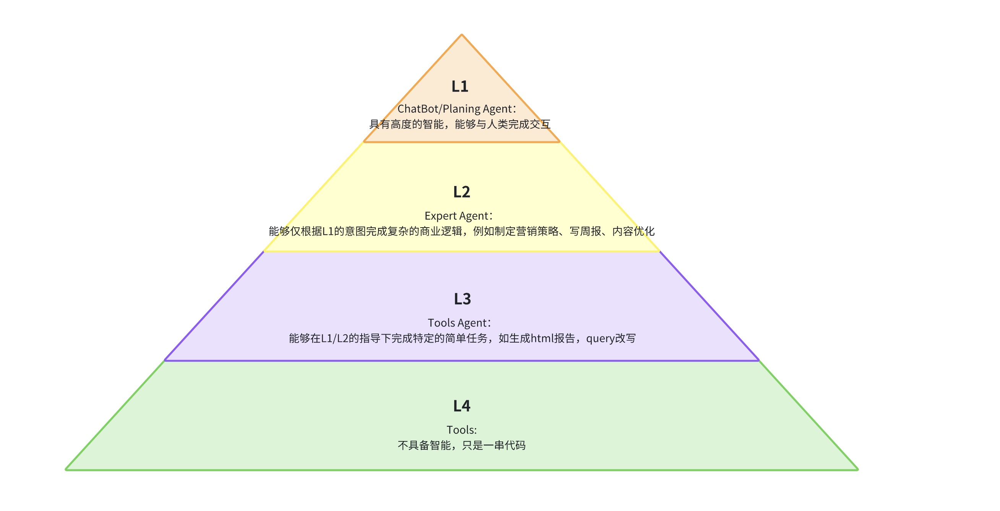

# AI agent 架构

## 目录
- chatbot:
    - 迎宾机器人：用prompt预先设定背景与可以做什么，当意图不足以进行社媒调研deep research时，进行正常对话或验证意图；当意图清晰时调用query rewriter模块开始向服务端要求数据。
    - 风控机器人：MVP暂时先不做，等后续需要应对监管的时候再做。
- planing系统: 
    - 一期先只是确定需要进行哪些分析：把分析师agent像function call一样喂给planing模型，模型选择需要进行的分析
    - 二期分析师多了之后，要增加planing展示，让用户可以修改关键词和分析内容
- agent: 
    - 一个agent就是一个分析师
    - 一个分析师就是一个行为树
    - 行为树的叶子节点就是一个工具
- tools:
  - 数据获取：从数据库获取已经进行了原子处理的数据
  - 数据处理：进行高维数据分析。
    - 一期先预先定义好分析的内容（分析师行为树）
    - 二期可以让模型根据洞察进行进一步的深度分析（reflection + function call）
  - 数据可视化：将分析结果可视化。这里先改成用prompt直接让模型生成html
- momery:
  - 短期记忆：用户行为。需要增加一个专门的总结模块。
  - 长期记忆：历史的分析结果。需要增加RAG功能
- reflection:
  - 这里需要反思数据是否正确，是否需要补充或者重新分析

## Data
原子化数据处理工具
| 工具函数 | 描述 | 输入 | 输出 |
|---------|------|------|------|
| batch_analyze_brand_mentions | 批量分析品牌提及频次 | 内容列表, LLM实例, 批处理大小 | 品牌提及频次列表 |
| batch_analyze_user_competition | 批量分析用户竞争情况 | 内容列表, LLM实例, 批处理大小 | 用户竞争情况列表 |
| extract_main_brands | 提取主要品牌并准备数据 | 解析后的数据, 品牌提及列表, 完整内容列表 | 品牌列表和对应的内容列表 |
| batch_analyze_sentiment | 批量分析品牌情感和特征 | 内容列表, 品牌列表, LLM实例, 批处理大小 | 情感分析结果列表 |
| batch_analyze_strengths_weaknesses | 批量分析品牌优势和劣势 | 内容列表, 品牌列表, LLM实例, 批处理大小 | 优势劣势分析结果列表 |
| integrate_analysis_results | 整合所有分析结果 | 解析后的数据, 品牌提及分析结果, 用户竞争分析结果, 情感分析结果, 优势劣势分析结果 | 整合后的完整结果 |
| atomic_insights | 增强版内容分析函数，处理已解析的数据列表，使用批量处理提高效率 | 已解析的数据列表 (包含 title, detail_desc, comments 等键的字典列表), 输出目录(可选), 模型ID | 处理后的数据列表 |

## Agents
系统中包含5个专业分析师，每个分析师负责不同维度的数据分析：

1. **BrandAnalyzer (品牌分析师)**
   - 负责分析品牌声量、情感和特征
   - 主要功能：
     - `analyze_brand_mentions`: 分析品牌提及频次和占比，生成品牌声量分析
     - `analyze_brand_sentiment`: 分析品牌情感分布，提取正面、中性和负面评价

2. **CompetitorAnalyzer (竞争分析师)**
   - 负责分析竞争对手和竞争关系
   - 主要功能：
     - `analyze_competitor_relationships`: 分析主品牌与竞争对手的关系，包括用户摇摆和流出情况

3. **FeatureAnalyzer (产品特征分析师)**
   - 使用LLM发现用户真正关心的产品维度
   - 主要功能：
     - `analyze_product_features`: 分析产品特征和各品牌在不同特征上的表现，生成雷达图可视化

4. **KeywordAnalyzer (关键词分析师)**
   - 使用LLM发现真实用户表达
   - 主要功能：
     - `analyze_keywords`: 提取正面和负面关键词，生成词云图可视化

5. **TrendAnalyzer (趋势分析师)**
   - 展示热门帖子和讨论趋势
   - 主要功能：
     - `analyze_trends`: 分析行业趋势，提取热门话题和相关用户原声

6. **IPAnalyzer (IP分析师)**
   - 负责分析用户地理分布
   - 主要功能：
     - `analyze_ip_distribution`: 根据热度加权计算地区分布，区分发帖和评论的地域特征

每个分析师都具有生成数据驱动洞察的能力，并能将分析结果保存为JSON文件。

## Tools

系统中包含多种分析工具，主要分为以下几类：

| 类别 | 工具函数 | 描述 | 输入 | 输出 |
|------|---------|------|------|------|
| **数据提取** | `calculate_brand_mentions` | 计算品牌提及频次和占比 | 原始数据列表 | 品牌名称、提及次数和占比 |
| | `extract_user_quotes` | 提取用户原声，支持按品牌或特征筛选 | 原始数据列表，筛选条件 | 用户原声列表 |
| | `extract_top_k_contents` | 提取最热门的K条内容和评论 | 原始数据列表，K值 | 拼接的内容文本 |
| | `get_top_heat_posts` | 获取热度最高的帖子 | 原始数据列表，数量 | 热度最高的帖子列表 |
| | `calculate_content_heat` | 计算内容热度值 | 内容数据，是否为评论 | 热度值 |
| **LLM分析** | `analyze_content_with_llm` | 使用LLM对内容进行通用分析 | 原始数据，分析类型 | 分析结果 |
| | `calculate_sentiment_distribution` | 计算各品牌的情感分布 | 原始数据列表 | 品牌情感分布 |
| | `extract_feature_dimensions` | 使用LLM提取内容中的特征维度 | 原始数据列表 | 特征维度分析结果 |
| | `extract_keyword_analysis` | 使用LLM提取关键词分析 | 原始数据列表 | 关键词分析结果 |
| | `extract_competitor_relationships` | 使用LLM提取竞争关系分析 | 原始数据列表 | 竞争关系分析结果 |

这些工具函数为分析师提供数据处理和分析能力，支持从原始数据中提取有价值的洞察。每个工具都设计为独立的功能模块，便于扩展和维护。未来可以根据需求继续添加新的工具函数，如时间序列分析(趋势洞察)等。