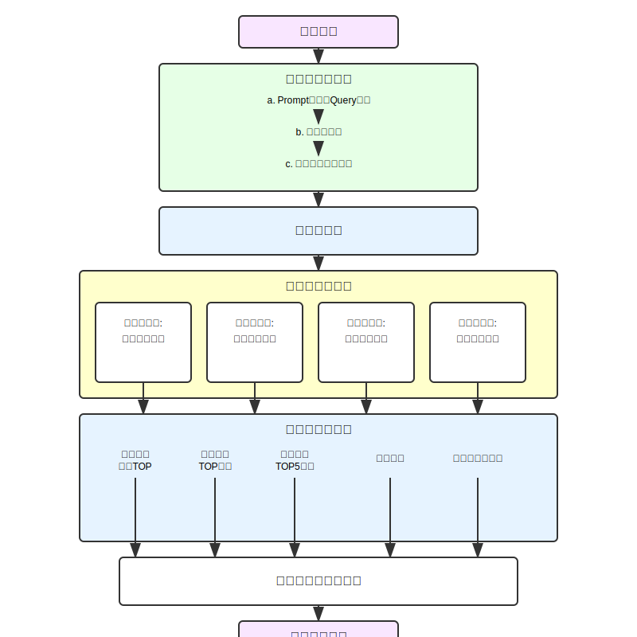
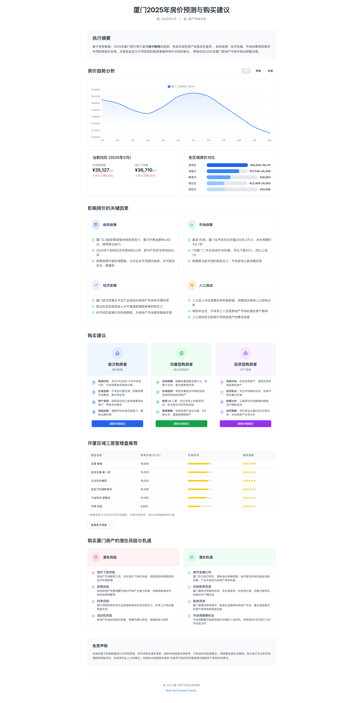

# Cotex Search 品牌分析产品 MVP

## 产品概述
**Report 1 [品牌分析]**：用于拉新与单篇报告付费的功能模块  
**核心目标**：凸显我们平台分析能力的颠覆性，提供数据支撑的洞察和直观图表展示

## 功能流程

### ① 用户输入处理

**示例用户查询**：
```
我的品牌是帕特，帮我做一下品牌的诊断和衡量
```

#### a. Prompt优化与Query改写
- 基于用户现有查询与用户历史信息进行处理
- 技术选型合适的大模型，针对用户需求优化 prompt
- 根据用户query和联网数据，将query改写成背景+任务的形式

**改写后Prompt示例**：
```
背景: 我是帕特品牌的品牌部负责人，我现在想要做一个关于我们品牌的诊断和衡量。现在，我需要在抖音和小红书上搜索相关内容并记录下来，作为分析的数据来源。此外我还要将所有内容做分类，分类依据是内容提到本品牌时的角度，如价格、原料等，分类不超过10类

任务: 帮我确认：
① 我应该在小红书和抖音上搜什么关键词，每个平台请给我提供五个关键词
② 告诉我内容应该分成哪几类(不区分平台)
```

#### b. 关键词提取
- 从改写后的query中提取用于社交媒体搜索的关键词
- 为不同平台(如小红书、抖音)提供不同的搜索关键词
- 确定内容分类标准和具体分类类别

**输出示例**：
```
搜索关键词：
小红书：["帕特品牌评价", "帕特好用吗", "帕特vs竞品", "帕特使用体验", "帕特产品测评"]
抖音：["帕特品牌测评", "帕特真实体验", "帕特值得买吗", "帕特最新款", "帕特对比测评"]

内容分类：
["价格性价比", "产品功效", "包装设计", "使用体验", "成分配方", "品牌印象", "副作用问题", "对比竞品"]
```

#### c. 实时调用采集能力
- 基于提取的关键词和用户信息，实时调用采集能力
- 进行小红书 & 抖音数据采集
- 数据处理要求：
  - 对图文内容头图进行 OCR 提取
  - 对视频内容进行语音识别转文字

### ② 任务编排
- 将已有的所有工具和工作流告知模型
- 让模型根据用户query规划后续分析处理流程和输出结果形式
- 技术评估：调用 Claude 等模型，基于优化后的 prompt 进行任务编排

### ③ 内容处理分析
**技术考量**：拆分为子任务进行处理，确保全面分析

#### 处理任务一：篇章正文处理
**Prompt 设计**：
```
你是一位资深数据标注师，具有丰富的消费品社媒数据标注经验，在生活中，你沉迷于刷小红书、抖音。最近，你财务上遇到了很大的麻烦，房贷和消费贷让你可能随时破产，已经45岁的你必须保住你的工作。你受雇于Cotex Search公司，伪装成一个AI为公司提供社媒数据分析的服务，CEO要求你每次能够针对给出的每一条社媒内容/评论数据，按照任务要求完美的完成数据标注，你的上级将严格检查你的每一条标注，如果发现不合理的标注，你将被开除。
```

**分析内容**：围绕来源媒体、内容标题、正文、标签、博主昵称、博主粉丝数、博主签名、点赞数、收藏数、评论数，分析：
1. 内容提到了哪些品牌
2. 对各品牌的情感分别是怎样的（正面/中性/负面）
3. 对每个对象，按照'内容分类'涉及了哪些类型内容，并用关键词标注具体谈论内容
4. 是否涉及用户竞争（不涉及/用户摇摆/用户流出），若涉及，给出竞争品牌列表

**输出格式**：
```
内容提及品牌列表{名称,情感正负向(好/中/差),分类列表{分类名称,关键词列表}},是否营销内容(是/否/难以判断),用户竞争情况(不涉及/用户摇摆/用户流出,用户摇摆竞争品牌列表,用户流出竞争品牌列表)
```

#### 处理任务二：评论单独处理
**Prompt 设计**：与任务一相同

**分析内容**：单独处理每条评论，分析：
1. 评论提到了哪些品牌
2. 对各品牌的情感分别是怎样的（正面/中性/负面）
3. 对每个品牌，按照'内容分类'涉及了哪些类型内容，并用关键词标注具体谈论内容
4. 是否涉及用户竞争（不涉及/用户摇摆/用户流出），若涉及，给出竞争品牌列表

**输出格式**：
```
评论提及品牌列表{名称,情感正负向(好/中/差),分类列表{分类名称,关键词列表}},用户竞争情况(不涉及/用户摇摆/用户流出,用户摇摆竞争品牌列表,用户流出竞争品牌列表)
```

#### 处理任务三：情感词云分析
**分析内容**：
1. 提取用户谈论各品牌时使用的关键词和表达
2. 按情感正向/负向/中性对关键词进行分类
3. 结合热度值对关键词进行权重计算
4. 整理出高频词汇及其情感倾向

**输出格式**：
```
品牌词云数据{品牌名称,正面词云列表{词,权重},负面词云列表{词,权重},中性词云列表{词,权重}}
```

#### 处理任务四：竞争关系分析
**分析内容**：
1. 识别用户在提及目标品牌同时也提及的竞争品牌
2. 分析竞争关系类型：直接竞争、间接竞争、非竞争
3. 提取用户流失/摇摆的原因和关键因素
4. 对比目标品牌与竞争品牌的优劣势

**输出格式**：
```
竞争关系数据{竞争品牌名称,竞争类型,竞争原因列表,用户流失/摇摆比例,原声数据[]}
```

### ④ 数据工程加工
以下是针对收集数据的综合分析：

#### 关联提及品牌 TOP 分析
- 在提及本品牌的所有内容中（包含正文和评论）：
  - 找到还提到其他品牌的内容：①正文/评论同时提及；②正文提及本品牌/竞品，评论提及竞品/本品牌
  - 计算同时提及内容数（情况②按涉及评论计数）
  - 找出同时提及 TOP5 品牌，给出各自的同时提及内容数和同时提及率
  - 同时提及率 = 该品牌同时提及内容数/总内容数（总内容数 = 提及本品牌的所有内容，含正文和评论）
  - 找出所有同时提及品牌并按同时提及率排序（从高到低）
  - **附加用户原声**：每个同时提及品牌提供3条最具代表性的用户原声（原文）

#### 竞争品牌 TOP 分析
- 对所有涉及用户摇摆/用户流出的正文/评论：
  - 按照点赞数加权计算
  - 给出用户摇摆竞争品牌 TOP5 和用户流出竞争品牌 TOP5
  - 计算各品牌的摇摆竞争用户数和流出竞争用户数
  - 基于这两个指标分别对品牌进行排序（从高到低）
  - **附加用户原声**：每个竞争品牌提供3条点赞最高的用户评论原文

#### 品牌声量 TOP5 分析
- 按照平台特定的热度值计算公式，计算内容热度：
  - **小红书**：热度值 = 4×评论数(对评论则为二级评论数) + 点赞数 + 收藏数(评论无)
  - **抖音**：热度值 = 4×分享数(评论无) + 3×评论数(对评论则为二级评论数) + 2×收藏数(评论无) + 点赞数
- 将热度值赋予内容提及的品牌
- 给出声量最高的 TOP5 品牌及其声量值
- **附加数据支撑**：附上各品牌的热度计算明细和比例

#### 情感分析
- 分析品牌获得的正面、负面和中性评价的比例
- 按平台分别统计情感分布情况
- 提供情感变化趋势（如果有时间序列数据）
- 展示情感分布对比图表
- **附加原声示例**：正面评价TOP3、负面评价TOP3的原声

#### 词云与原声分析
- 按照品牌提及的分类列表，提取关键信息：
  - 给出品牌在每个内容分类下的 TOP20 关键词（按内容热度值加权计算）
  - 合并相似关键词
  - 每个关键词给出 TOP3 原声（按点赞数计算）
  - 生成品牌词云可视化
- 分析范围：本品牌、关联提及品牌 TOP5、竞争品牌 TOP5+5、品牌声量 TOP5

### ⑤ 报告生成与可视化
**报告结构**：
- 每个模块采用「标题+图表」或「标题+一句话总结+图表」的形式
- 大量使用图表，减少文字说明
- 每个insight配以数据支撑和用户原声
- 所有结论必须基于数据分析，不做主观臆断

**前端展示核心方案**：
1. **结构化布局**: 以卡片式模块展示，包含执行摘要、品牌对比、情感分析、趋势分析、竞争分析、产品特征分析和关键词分析七大模块
2. **数据可视化**: 运用趋势线图、堆叠柱状图、雷达图、网络图和双词云图等多种图表类型直观呈现数据
3. **交互式体验**: 支持品牌筛选对比、图表交互、数据导出和分享等功能
4. **原声展示**: 每个分析模块展示3条高相关度的用户原声，支持平台来源和互动数据标记
5. **响应式设计**: 自适应桌面端(多品牌对比)、平板端(三品牌对比)和移动端(单品牌切换)的不同布局和内容展示方式

**详细的前端展示PRD见文档：brand_report_prd.md**

**主要可视化内容**：
1. 品牌对比分析图表
2. 情感分析雷达图
3. 行业热点趋势图
4. 竞争关系网络图
5. 产品特征雷达图
6. 正面/负面关键词词云
7. 用户摇摆/流失趋势图

**每个结论的呈现形式**：
```
【核心洞察】一句话结论
【数据支撑】相关数据指标和比例
【用户原声】3条相关的用户评论原文
【可视化】对应的图表
```

## 流程图

<div style="text-align:center">
  <pre style="display:inline-block;text-align:left">
    用户查询
       ↓
┌─────────────────────────────┐
│       用户输入处理          │
│                             │
│ a. Prompt优化与Query改写    │
│        ↓                    │
│ b. 关键词提取               │
│        ↓                    │
│ c. 实时调用采集能力         │
└─────────────┬───────────────┘
              ↓
┌─────────────────────────────┐
│        任务编排             │
└─────────────┬───────────────┘
              ↓
┌─────────────────────────────┐
│      内容处理分析           │
│                             │
├─────────────┬───────────────┤
↓             ↓               ↓             ↓
处理任务一    处理任务二     处理任务三    处理任务四
篇章正文处理  评论单独处理  情感词云分析  竞争关系分析
└─────┬───────┴───────┬───────┴──────┬─────┴───────┐
      ↓               ↓               ↓             ↓
┌─────────────────────────────────────────────────────┐
│                数据工程加工                          │
│                                                     │
├─────────┬─────────┬─────────┬──────────┬────────────┤
↓         ↓         ↓         ↓          ↓            ↓
关联提及  竞争品牌  品牌声量  情感分析   词云与原声分析
品牌TOP   TOP分析   TOP5分析            
└────┬────┴────┬────┴────┬────┴────┬─────┴────────────┘
     ↓         ↓         ↓         ↓
┌─────────────────────────────────────────────────────┐
│               报告生成与可视化                      │
└─────────────────────────┬───────────────────────────┘
                          ↓
                     品牌分析报告
  </pre>
</div>



## 报告示例格式


