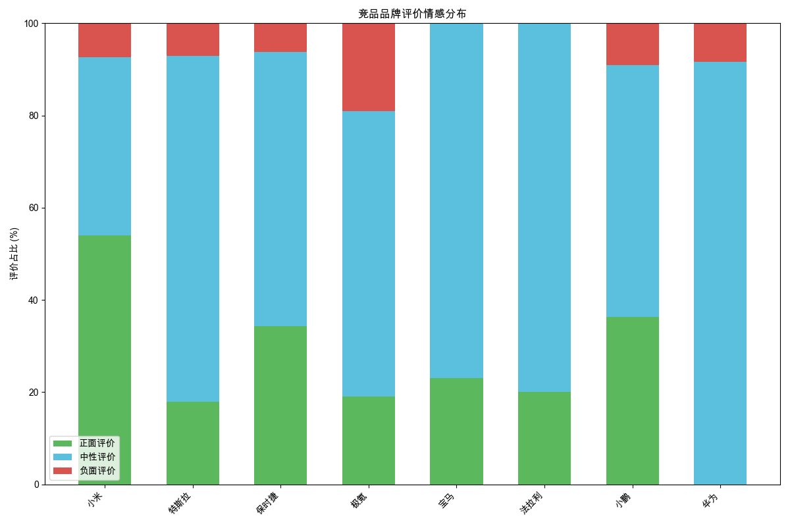
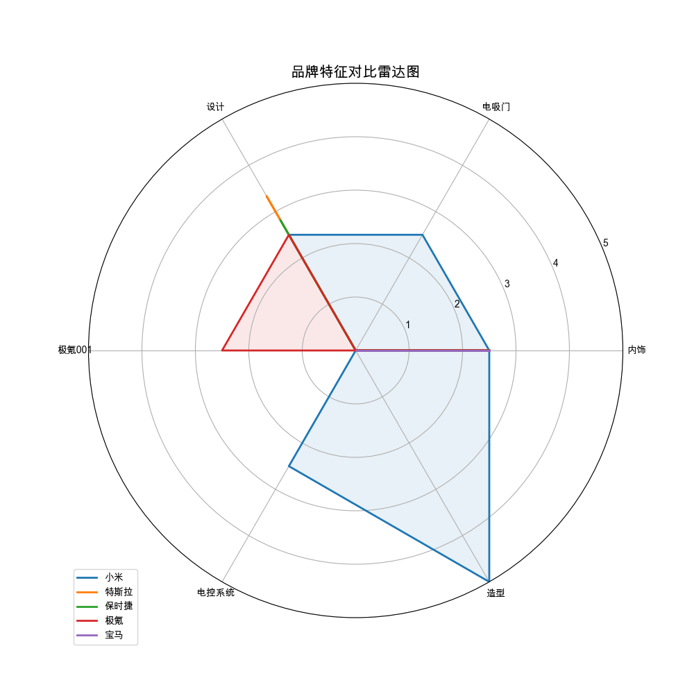

# 竞品对比分析

# 汽车品牌竞品分析报告

## 1. 市场地位和热度差异

从热度排名来看，**小米**以1609的热度遥遥领先，远超其他品牌。紧随其后的是**特斯拉**（97）、**保时捷**（86）和**极氪**（53），而**宝马**、**法拉利**、**小鹏**和**华为**的热度相对较低。小米的高热度可能与其近期推出的SU7系列车型有关，尤其是其Ultra版本，凭借高性能和豪华配置吸引了大量关注。特斯拉和保时捷作为传统高端品牌，热度保持稳定，而极氪、小鹏和华为作为新兴品牌，热度相对较低，市场认知度仍需提升。

## 2. 用户评价差异

从情感分布来看，**小米**的正面评价占比最高（53.7%），负面评价占比最低（7.4%），用户对其性价比、性能和设计给予了高度认可。**特斯拉**和**保时捷**的正面评价占比也较高，分别为17.9%和34.4%，但特斯拉的负面评价占比略高（7.1%），主要集中在其驾驶体验和智能化水平上。**极氪**和**小鹏**的正面评价占比相对较低，分别为19.0%和12.5%，且负面评价占比偏高，用户对其续航和操控性存在较多不满。**华为**的正面评价占比为0，负面评价占比为3.3%，用户对其产品定位和智能化体验表示失望。

## 3. 产品特点对比

- **小米**：SU7系列以高性价比、强劲动力和豪华配置为卖点，尤其是Ultra版本，凭借三电机系统和碳纤维材料，成为性能控的首选。然而，其续航表现和充电依赖超充桩的问题仍需改进。
- **特斯拉**：以智能化和驾驶体验著称，Model 3和Model Y在市场上表现强劲。但其续航虚标和充电兼容性问题引发用户不满。
- **保时捷**：传统豪华品牌，以卓越的操控性和设计感吸引高端用户。然而，其价格高昂，维修成本高，用户对其性价比存疑。
- **极氪**：主打性价比和家用适用性，但续航和操控性表现一般，用户对其产品力评价不高。
- **小鹏**：以智驾体验和舒适度见长，但其续航和配置表现平平，用户对其性价比和品牌认知度存疑。
- **华为**：虽然以智能化著称，但其产品定位模糊，续航和智能化体验未达用户预期，市场表现不佳。

## 4. 小米汽车的竞争位置

小米汽车的直接竞争对手主要包括**特斯拉**和**保时捷**。特斯拉在智能化和驾驶体验上具有优势，而保时捷在豪华感和操控性上更胜一筹。小米通过高性价比和豪华配置，成功吸引了部分特斯拉和保时捷的用户，尤其是在追求性能和豪华感的年轻用户群体中。此外，小米还与**极氪**和**小鹏**在性价比和家用适用性上展开竞争，但其续航和充电问题仍需解决。

## 5. 竞品分析的关键发现和战略建议

- **关键发现**：小米汽车凭借高性价比和豪华配置，成功吸引了大量关注，但其续航和充电问题仍需改进。特斯拉和保时捷在智能化和豪华感上具有优势，但价格高昂。极氪和小鹏在性价比和家用适用性上表现平平，市场认知度较低。
- **战略建议**：
  1. **提升续航和充电体验**：小米应加强电池技术研发，提升续航表现，并扩大超充桩的覆盖范围，解决用户续航焦虑。
  2. **优化智能化体验**：小米应进一步提升智驾系统的稳定性和智能化水平，缩小与特斯拉的差距。
  3. **加强品牌建设**：小米应通过营销和用户体验，提升品牌认知度和用户忠诚度，尤其是在高端用户群体中。
  4. **差异化竞争**：小米应继续发挥其性价比和豪华配置的优势，与特斯拉和保时捷展开差异化竞争，吸引更多追求性能和豪华感的用户。

通过以上策略，小米汽车有望在激烈的市场竞争中脱颖而出，进一步巩固其市场地位。

## 数据可视化

