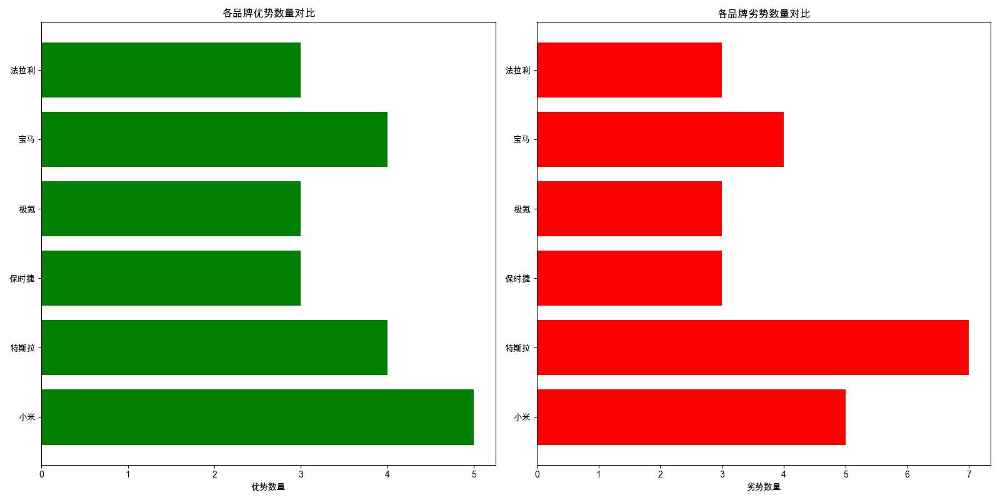

# 小米与竞品优劣势分析

# 小米汽车优劣势分析

## 1. 小米的核心优势和主要劣势

### 核心优势
- **性价比**: SU7价格亲民，配置丰富，适合预算有限但追求高配置的用户。
- **性能**: Ultra动力强劲，加速快，满足对驾驶性能有高要求的用户。
- **设计**: 溜背造型，多配色选择，外观时尚，吸引年轻消费者。
- **智能配置**: 标配Xiaomi HAD智驾系统，提供先进的智能驾驶体验。
- **续航**: SU7续航长，适合日常通勤，减少充电频率。

### 主要劣势
- **舒适性**: SU7底盘偏硬，后排空间小，影响乘坐舒适性。
- **维修成本**: Ultra碳纤维部件维修昂贵，增加后期使用成本。
- **充电便利性**: SU7在三四线城市充电不便，影响用户体验。
- **价格**: Ultra价格高，交付周期长，可能影响购买决策。
- **依赖超充**: Ultra依赖超充桩满速充电，限制了充电灵活性。

## 2. 小米与主要竞品相比的竞争力与差距

### 竞争力
- **性价比**: 与特斯拉、保时捷、宝马等相比，小米在价格上具有明显优势。
- **智能配置**: 小米的智能配置与特斯拉相当，甚至在某些方面超越传统豪华品牌。
- **续航**: 小米的续航能力与极氪相当，优于宝马和保时捷的燃油车型。

### 差距
- **品牌形象**: 与保时捷、宝马、法拉利相比，小米的品牌认知度和豪华感较弱。
- **舒适性**: 在舒适性方面，小米与保时捷、宝马等豪华品牌存在明显差距。
- **充电便利性**: 特斯拉在充电网络建设上领先，小米在三四线城市的充电便利性不足。

## 3. 用户最关注的产品特性和体验

- **智能配置**: 用户越来越重视智能驾驶和车机系统的体验，小米在这方面表现优异。
- **续航与充电**: 续航能力和充电便利性是电动车用户关注的重点，小米在续航上表现良好，但充电便利性需改进。
- **舒适性**: 舒适性直接影响用户的日常使用体验，小米在这方面需提升。

## 4. 小米需要改进的关键方面

- **舒适性**: 优化底盘调校，增加后排空间，提升乘坐舒适性。
- **充电网络**: 加快在三四线城市的充电网络建设，提高充电便利性。
- **品牌建设**: 加强品牌宣传，提升品牌形象和豪华感，吸引更多高端用户。

## 5. 基于优劣势分析的战略建议

- **差异化竞争**: 利用性价比和智能配置优势，与豪华品牌形成差异化竞争。
- **用户体验优化**: 重点改进舒适性和充电便利性，提升用户日常使用体验。
- **品牌升级**: 通过高端车型和品牌活动，逐步提升品牌形象，吸引更多高端用户。
- **市场拓展**: 针对三四线城市用户，加强充电网络建设，扩大市场份额。

通过以上分析和建议，小米汽车可以在竞争激烈的市场中找到自己的定位，并通过持续改进和优化，提升用户满意度和市场竞争力。

## 数据可视化

## 详细优劣势对比

### 小米

#### 优势

| 方面 | 描述 |
|------|------|
| 性价比 | SU7价格亲民，配置丰富 |
| 性能 | Ultra动力强劲，加速快 |
| 设计 | 溜背造型，多配色选择 |
| 智能配置 | 标配Xiaomi HAD智驾系统 |
| 续航 | SU7续航长，适合通勤 |

#### 劣势

| 方面 | 描述 |
|------|------|
| 舒适性 | SU7底盘偏硬，后排空间小 |
| 维修成本 | Ultra碳纤维部件维修昂贵 |
| 充电便利性 | SU7三四线城市充电不便 |
| 价格 | Ultra价格高，交付周期长 |
| 依赖超充 | Ultra依赖超充桩满速充电 |
### 特斯拉

#### 优势

| 方面 | 描述 |
|------|------|
| 隔音效果 | 车内静谧，行驶质感优秀 |
| 智能化体验 | 车载AI反应自然，指令应对灵活 |
| 操控性能 | 转向灵敏，动力十足，底盘调教出色 |
| 车机系统 | 操作丝滑，满足日常需求 |

#### 劣势

| 方面 | 描述 |
|------|------|
| 操控感 | 方向盘轻，虚位明显，指向性模糊 |
| 踏板反馈 | 前段灵敏，后段柔和，体验不线性 |
| 驾驶辅助 | 系统未更新，功能缺失 |
| 座舱质感 | 细节粗糙，质感不足 |
| 后排舒适性 | 座椅平，腿部支撑不足，头部空间压抑 |
| 高速风噪 | 噪音明显，影响舒适性 |
| 音响质量 | 音响效果一般，不满足高要求 |
### 保时捷

#### 优势

| 方面 | 描述 |
|------|------|
| 品牌形象 | 高端豪华，历史悠久，具有强大品牌认知度 |
| 驾驶体验 | 操控精准，动力强劲，驾驶乐趣高 |
| 内饰品质 | 用料考究，设计精致，豪华感强 |

#### 劣势

| 方面 | 描述 |
|------|------|
| 价格 | 售价高昂，维修保养费用高 |
| 实用性 | 空间有限，不适合家庭日常使用 |
| 燃油经济性 | 油耗较高，环保性能一般 |
### 极氪

#### 优势

| 方面 | 描述 |
|------|------|
| 品牌信任 | 小米产品质量好，价格亲民。 |
| 外观设计 | 贯穿式LED大灯，尾灯设计时尚。 |
| 续航能力 | 综合续航1500公里，满足长途需求。 |

#### 劣势

| 方面 | 描述 |
|------|------|
| 尺寸问题 | 尺寸过大，停车不便。 |
| 内饰质感 | 内饰塑料感强，影响体验。 |
| 智驾系统 | 智驾体验不佳，安全性存疑。 |
### 宝马

#### 优势

| 方面 | 描述 |
|------|------|
| 操控性能 | 宝马M3操控精准，驾驶体验出色。 |
| 传统豪华 | 内饰真皮包裹，豪华质感无可挑剔。 |
| 品牌认知 | 宝马品牌历史悠久，市场认可度高。 |
| 燃油技术 | 3.0T直六发动机，燃油车中的佼佼者。 |

#### 劣势

| 方面 | 描述 |
|------|------|
| 智能化 | 智能驾驶停留在L2级，缺乏未来感。 |
| 加速性能 | 相比电动车，加速性能略显不足。 |
| 油耗 | 百公里油耗较高，经济性不如电动车。 |
| 内饰设计 | 内饰设计保守，缺乏未来科技感。 |
### 法拉利

#### 优势

| 方面 | 描述 |
|------|------|
| 品牌效应 | 法拉利被视为顶级豪车品牌，具有极高的品牌影响力。 |
| 设计美感 | 法拉利的设计被认为比小米更具吸引力。 |
| 赛道性能 | 法拉利在赛道性能上表现出色，接近专业赛车。 |

#### 劣势

| 方面 | 描述 |
|------|------|
| 价格 | 法拉利价格高昂，普通人难以承受。 |
| 电车转型 | 法拉利在电车领域的发展较慢，面临淘汰风险。 |
| 品牌对比 | 法拉利在与小米的对比中被认为处于劣势。 |
