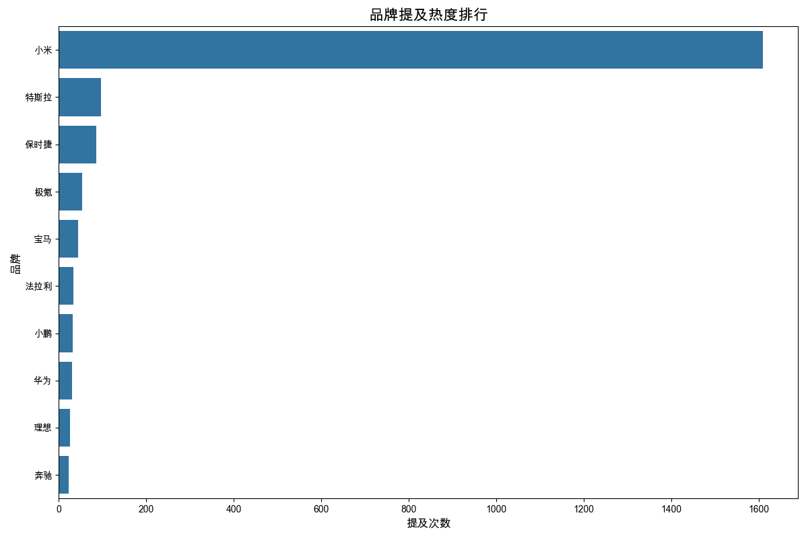
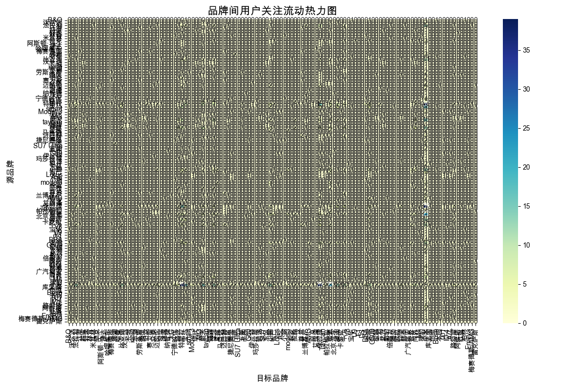

# 用户品牌抢夺行为分析

# 品牌竞品分析报告

## 1. 用户关注度最高的品牌及原因

**小米**以1609次提及频次位居榜首，远超其他品牌。这可能是由于小米作为科技巨头进军汽车行业，引发了广泛的关注和讨论。其次是**保时捷**（86次）和**特斯拉**（97次），这两个品牌分别代表了传统豪华汽车和新兴电动汽车领域的标杆，吸引了大量高端用户和科技爱好者的关注。

## 2. 品牌间的用户争夺关系

- **小米与保时捷**：双向用户流动均为39次，表明这两者之间存在显著的竞争关系。小米可能吸引了部分对保时捷感兴趣的豪华车用户，而保时捷也在争夺小米的科技用户。
- **小米与特斯拉**：双向用户流动均为39次，显示出两者在电动汽车市场的激烈竞争。特斯拉作为行业领导者，面临小米这一新晋挑战者的威胁。
- **保时捷与特斯拉**：双向用户流动分别为15次和7次，显示出两者在高端电动汽车市场的竞争关系。

## 3. 用户购买汽车的典型考虑路径

用户在购买汽车时，通常会经历以下路径：
1. **品牌筛选**：根据品牌知名度和口碑进行初步筛选，如小米、保时捷和特斯拉。
2. **功能对比**：关注汽车的性能、科技配置和价格，如小米的科技配置和特斯拉的自动驾驶技术。
3. **品牌忠诚度**：部分用户会基于品牌忠诚度进行最终决策，如保时捷的豪华车用户。
4. **用户体验**：试驾和售后服务体验也是重要决策因素。

## 4. 主要品牌的用户粘性和用户流失风险

- **小米**：作为新晋品牌，用户粘性较低，但凭借其强大的科技背景和用户基础，具有较高的潜在用户吸引力。用户流失风险主要来自产品实际表现与用户期望的差距。
- **保时捷**：用户粘性高，品牌忠诚度强，但面临新兴品牌的竞争压力，用户流失风险相对较低。
- **特斯拉**：用户粘性较高，但市场竞争激烈，用户流失风险主要来自竞争对手的创新和价格战。

## 5. 小米汽车在用户争夺方面的优势和劣势

**优势**：
- **品牌影响力**：小米在科技领域的强大品牌影响力有助于吸引科技爱好者和年轻用户。
- **生态系统**：小米的智能生态系统可以为汽车用户提供无缝连接体验，增强用户粘性。
- **价格优势**：小米以性价比著称，可能吸引价格敏感型用户。

**劣势**：
- **品牌认知**：作为汽车行业的新手，小米在汽车领域的品牌认知度较低，用户信任度有待建立。
- **技术积累**：相比特斯拉等老牌电动汽车厂商，小米在汽车技术方面的积累较少，可能影响用户对产品性能的信任。
- **售后服务**：汽车售后服务网络的建立需要时间，初期可能影响用户体验。

通过以上分析，可以看出小米汽车在用户争夺方面具有显著优势，但也面临诸多挑战。未来，小米需要在品牌建设、技术研发和售后服务方面持续投入，以巩固其在汽车市场的地位。

## 数据可视化

