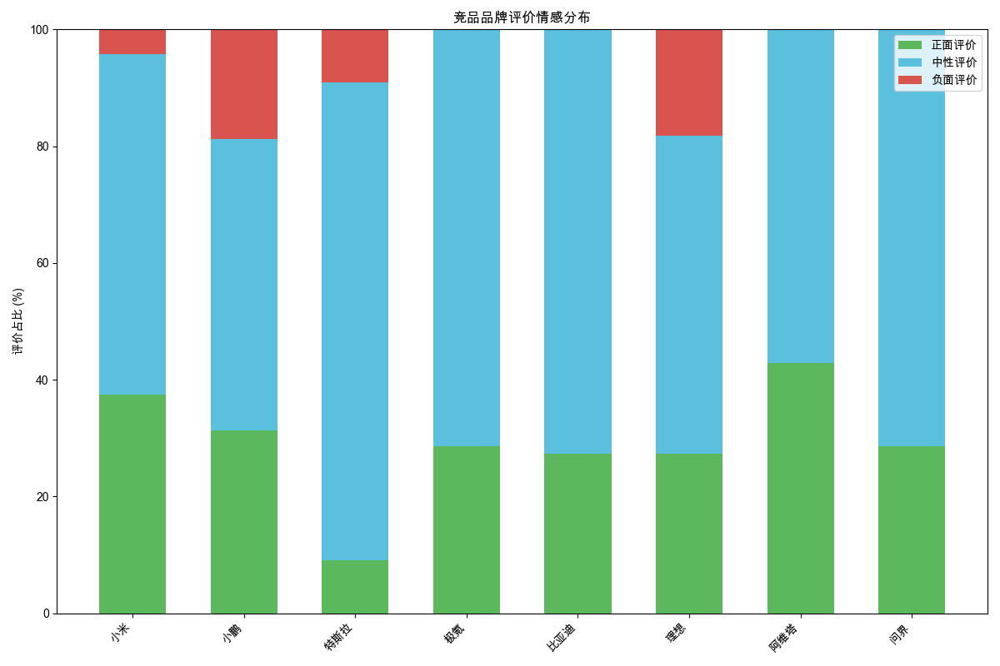
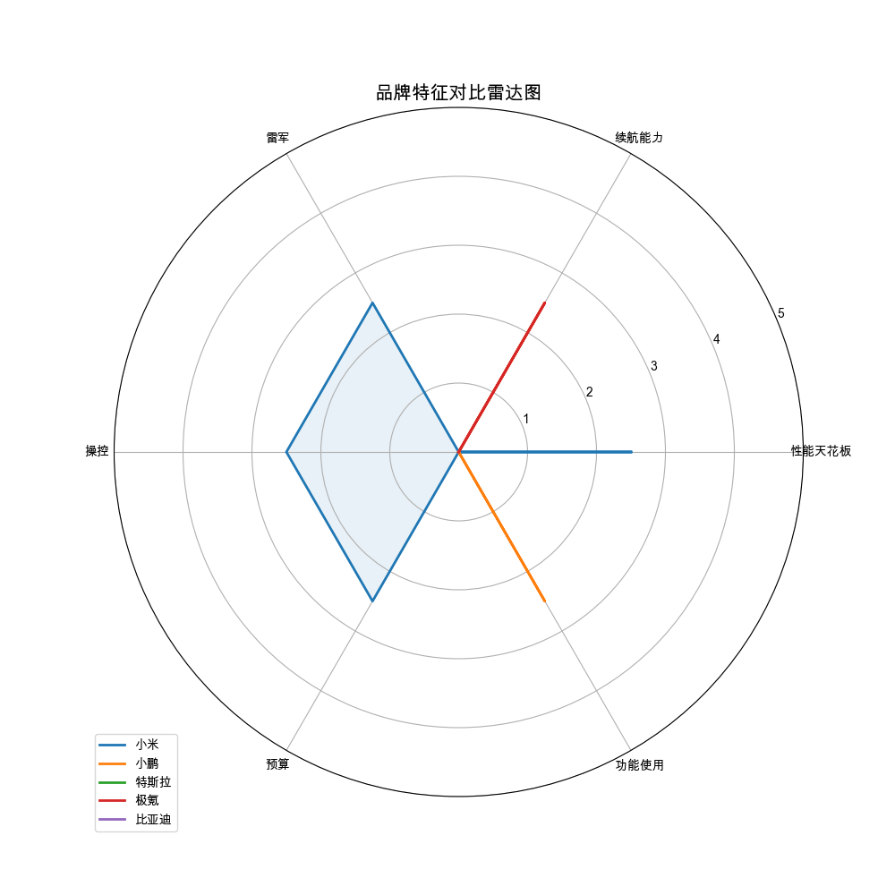

# 竞品对比分析

# 汽车品牌竞品分析报告

## 1. 市场地位与热度差异
- **小米**以99分的热度遥遥领先，远超其他品牌，显示出极高的市场关注度。
- **小鹏**和**特斯拉**分别以65分和45分位列第二和第三，显示出较强的市场存在感。
- **极氪**、**比亚迪**、**理想**、**阿维塔**和**问界**的热度相对较低，分别为41分、37分、31分、18分和16分，表明这些品牌在市场中的关注度较低。

## 2. 用户评价差异
- **小米**的用户评价以正面为主，正面评价占比9%，中性评价14%，负面评价仅1%，显示出良好的用户口碑。
- **小鹏**和**特斯拉**的正面评价分别为5%和1%，中性评价分别为8%和9%，负面评价分别为3%和1%，显示出用户评价较为中性。
- **极氪**、**比亚迪**、**理想**、**阿维塔**和**问界**的正面评价分别为4%、3%、3%、3%和2%，中性评价分别为10%、8%、6%、4%和5%，负面评价分别为0%、0%、2%、0%和0%，显示出这些品牌的用户评价较为中性，但负面评价较少。

## 3. 产品特点对比
- **小米**：以高颜值、高性价比、高科技配置和强劲性能为主要特点，但在尺寸和空间上存在一定劣势。
- **小鹏**：以高颜值、高科技配置和性价比为主要特点，但在品牌认知和市场表现上存在一定劣势。
- **特斯拉**：以成熟的自动驾驶技术和品牌影响力为主要特点，但在外观设计和市场限制上存在一定劣势。
- **极氪**：以高颜值、高性能和性价比为主要特点，但在智驾水平和软件OTA上存在一定劣势。
- **比亚迪**：以多样化的车型选择和优异的销量表现为主要特点，但在品牌影响力和市场地位上存在一定劣势。
- **理想**：以高颜值、大空间和长续航为主要特点，但在品牌认知和市场表现上存在一定劣势。
- **阿维塔**：以超前内饰设计和优异智驾系统为主要特点，但在销量和市场表现上存在一定劣势。
- **问界**：以华为技术优势和智能化配置为主要特点，但在品牌认知和市场表现上存在一定劣势。

## 4. 小米汽车的竞争位置
- **小米**与**小鹏**、**特斯拉**和**极氪**的竞争最为直接，这些品牌在高科技配置、性价比和性能上具有相似的特点。
- **小米**在用户评价和市场热度上具有明显优势，但在品牌认知和市场限制上存在一定劣势。

## 5. 竞品分析的关键发现和战略建议
- **关键发现**：小米在用户评价和市场热度上具有明显优势，但在品牌认知和市场限制上存在一定劣势。小鹏和特斯拉在用户评价和市场存在感上较为中性，但在品牌认知和市场表现上存在一定劣势。极氪、比亚迪、理想、阿维塔和问界在用户评价和市场热度上较为中性，但在品牌认知和市场表现上存在一定劣势。
- **战略建议**：小米应加强品牌认知和市场限制的应对策略，以巩固其市场地位。小鹏和特斯拉应加强品牌认知和市场表现的提升策略，以增强其市场存在感。极氪、比亚迪、理想、阿维塔和问界应加强品牌认知和市场表现的提升策略，以增强其市场存在感。

## 数据可视化

