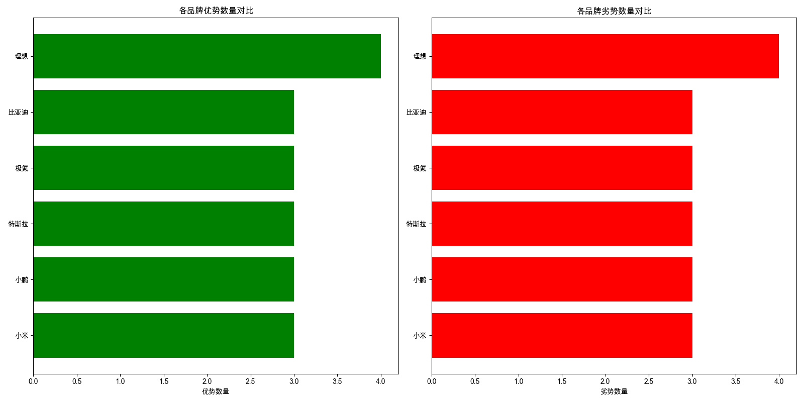

# 小米与竞品优劣势分析

# 小米汽车优劣势分析

## 1. 小米的核心优势和主要劣势

**核心优势：**
- **外观设计**：小米SU7外观时尚，符合年轻消费者审美，能够吸引追求个性化的用户。
- **科技配置**：配备高科技配置，如智能驾驶系统和先进的车载娱乐系统，吸引科技爱好者。
- **性价比**：价格合理，性价比高，适合预算有限但追求高品质的消费者。

**主要劣势：**
- **品牌认知**：小米汽车品牌认知度较低，市场接受度待提升，需要加强品牌建设和市场推广。
- **内饰设计**：内饰设计被认为较为普通，缺乏创新，可能影响高端用户的购买决策。
- **市场竞争**：面对特斯拉等强敌，市场竞争压力大，需要差异化策略来突出自身优势。

## 2. 小米与主要竞品相比的竞争力与差距

**竞争力：**
- **外观设计**：小米SU7的外观设计与小鹏P7和极氪001相比，具有相似的时尚感，能够吸引年轻消费者。
- **科技配置**：小米SU7的科技配置与特斯拉和理想L6相比，具有一定的竞争力，特别是在智能驾驶和车载娱乐系统方面。
- **性价比**：小米SU7的性价比与比亚迪汉DM-i和小鹏G9相比，具有明显优势，适合预算有限的消费者。

**明显差距：**
- **品牌影响力**：与特斯拉和比亚迪相比，小米的品牌影响力较弱，需要加强品牌建设和市场推广。
- **内饰设计**：与极氪001和理想L6相比，小米SU7的内饰设计较为普通，缺乏创新，可能影响高端用户的购买决策。
- **智驾体验**：与特斯拉和小鹏相比，小米的智驾系统技术尚需提升，特别是在国内市场的实际体验方面。

## 3. 用户最关注的产品特性和体验，小米在这些方面的表现

**用户关注的产品特性和体验：**
- **外观设计**：小米SU7外观时尚，符合年轻消费者审美，能够吸引追求个性化的用户。
- **科技配置**：配备高科技配置，如智能驾驶系统和先进的车载娱乐系统，吸引科技爱好者。
- **性价比**：价格合理，性价比高，适合预算有限但追求高品质的消费者。
- **内饰设计**：小米SU7的内饰设计较为普通，缺乏创新，可能影响高端用户的购买决策。
- **智驾体验**：小米的智驾系统技术尚需提升，特别是在国内市场的实际体验方面。

## 4. 小米需要改进的关键方面

- **品牌建设**：加强品牌建设和市场推广，提升品牌认知度和市场接受度。
- **内饰设计**：提升内饰设计的创新性和高端感，吸引更多高端用户。
- **智驾系统**：提升智驾系统技术，特别是在国内市场的实际体验方面，增强用户的实际使用感受。
- **售后服务**：建立完善的售后服务体系，提升用户满意度和品牌忠诚度。

## 5. 基于优劣势分析的战略建议

- **差异化策略**：通过独特的外观设计和科技配置，突出小米SU7的个性化优势，吸引年轻消费者。
- **品牌推广**：加大品牌推广力度，提升品牌认知度和市场接受度，特别是在高端市场的影响力。
- **技术研发**：持续投入技术研发，特别是在智驾系统和内饰设计方面，提升产品的整体竞争力。
- **用户体验**：关注用户体验，提升售后服务质量和用户满意度，增强品牌忠诚度。
- **市场定位**：明确市场定位，针对不同消费群体制定差异化的营销策略，扩大市场份额。

通过以上战略建议，小米汽车可以在激烈的市场竞争中突出自身优势，弥补劣势，提升整体竞争力。

## 数据可视化

## 详细优劣势对比

### 小米

#### 优势

| 方面 | 描述 |
|------|------|
| 外观设计 | 小米SU7外观时尚，符合年轻消费者审美。 |
| 科技配置 | 小米SU7配备高科技配置，吸引科技爱好者。 |
| 性价比 | 小米SU7价格合理，性价比高。 |

#### 劣势

| 方面 | 描述 |
|------|------|
| 品牌认知 | 小米汽车品牌认知度较低，市场接受度待提升。 |
| 内饰设计 | 内饰设计被认为较为普通，缺乏创新。 |
| 市场竞争 | 面对特斯拉等强敌，市场竞争压力大。 |
### 小鹏

#### 优势

| 方面 | 描述 |
|------|------|
| 外观设计 | 小鹏P7外观设计受好评，颜值高。 |
| 智驾系统 | 小鹏G9 MAX版标配城区智驾，领先。 |
| 性价比 | 小鹏G9终端优惠大，性价比高。 |

#### 劣势

| 方面 | 描述 |
|------|------|
| 销量 | 小鹏P7销量相对较低，竞争力不足。 |
| 维修成本 | 激光雷达位置易损，维修成本高。 |
| 配置缺失 | 小鹏G9无抬显HUD，配置不全。 |
### 特斯拉

#### 优势

| 方面 | 描述 |
|------|------|
| 品牌影响力 | 特斯拉在电动汽车市场具有较高的品牌认知度 |
| 三电技术 | 特斯拉的三电技术领先，能耗表现优秀 |
| 智驾系统 | 特斯拉的辅助驾驶系统技术先进 |

#### 劣势

| 方面 | 描述 |
|------|------|
| 内饰设计 | 特斯拉的内饰设计被认为较为简单 |
| 配置 | 特斯拉的配置相比竞品略显不足 |
| 智驾体验 | 特斯拉的辅助驾驶在国内无法完全体验 |
### 极氪

#### 优势

| 方面 | 描述 |
|------|------|
| 外观设计 | 极氪001外观设计时尚，符合新能源车审美趋势 |
| 配置丰富 | 标配前排座椅通风、加热和按摩，提升舒适性 |
| 音响系统 | 全系标配21个扬声器，支持杜比全景声 |

#### 劣势

| 方面 | 描述 |
|------|------|
| 智驾体验 | 智驾系统处于第二梯队，软件OTA更新较慢 |
| 性价比 | 作为中型SUV，性价比相对较低 |
| 品牌忠诚度 | 部分老车主表示不会再次选择极氪 |
### 比亚迪

#### 优势

| 方面 | 描述 |
|------|------|
| 价格竞争力 | 比亚迪汉DM-i和海豹DM-i价格区间较低，性价比高 |
| 销量表现 | 比亚迪汉DM-i和EV在4月份销量领先 |
| 技术积累 | 比亚迪在插混领域技术领先，市场认可度高 |

#### 劣势

| 方面 | 描述 |
|------|------|
| 品牌溢价 | 相比豪华品牌，比亚迪品牌溢价能力较弱 |
| 科技感 | 相比小米SU7和特斯拉，科技配置略显不足 |
| 高端市场 | 在40万以上高端市场，比亚迪产品线较少 |
### 理想

#### 优势

| 方面 | 描述 |
|------|------|
| 外观设计 | 理想L6外观时尚，符合年轻消费者审美。 |
| 空间表现 | 理想L6空间大，适合家庭使用。 |
| 续航能力 | 理想L6续航长，满足长途驾驶需求。 |
| 智能驾驶 | 理想L6配备智能驾驶系统，提升驾驶体验。 |

#### 劣势

| 方面 | 描述 |
|------|------|
| 悬挂系统 | 理想L9悬挂偏软，影响操控性。 |
| 品牌认知 | 理想品牌知名度相对较低。 |
| 内饰设计 | 理想内饰设计较为传统，缺乏创新。 |
| 价格定位 | 理想车型价格较高，性价比不足。 |
