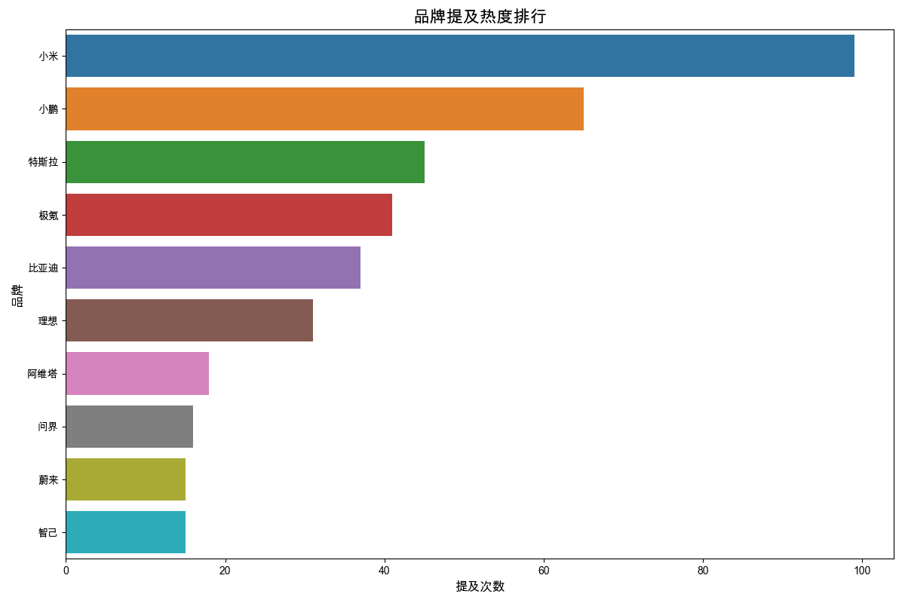
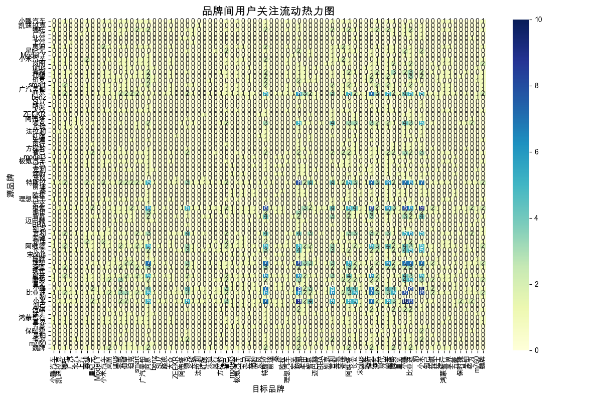

# 用户品牌抢夺行为分析

# 竞品数据分析报告

## 1. 用户关注度最高的品牌及原因

**小米**以99次的提及频次位居榜首，显示出极高的用户关注度。可能的原因包括：
- **品牌效应**：小米在消费电子领域的成功为其汽车业务带来了天然的品牌曝光和用户基础。
- **创新与性价比**：小米汽车可能延续了小米在性价比和创新上的优势，吸引了大量关注。
- **营销策略**：小米在营销上的投入和策略可能更为激进，进一步提升了品牌曝光。

其他高关注品牌如**小鹏**（65次）、**特斯拉**（45次）和**极氪**（41次）也显示出较强的市场存在感，可能与它们在电动汽车领域的技术积累和市场表现有关。

## 2. 品牌间的用户争夺关系

**小米**与**小鹏**、**极氪**、**特斯拉**等品牌之间存在明显的用户争夺关系。例如：
- **小米->小鹏**：10次用户流动，表明小米用户在考虑其他品牌时，小鹏是一个主要选择。
- **小米->极氪**：9次用户流动，显示极氪在高端市场对小米用户的吸引力。
- **小米->特斯拉**：7次用户流动，表明特斯拉作为行业标杆，对小米用户也有一定吸引力。

此外，**小鹏**和**极氪**之间的用户流动也较为频繁（8次），显示出这两个品牌在用户争夺上的激烈竞争。

## 3. 用户购车考虑路径

用户在购车时的典型考虑路径可能包括：
1. **品牌选择**：用户首先会根据品牌知名度、口碑和技术实力进行初步筛选。
2. **产品对比**：用户会在同价位或同类型的车型中进行详细对比，关注性能、续航、智能化等方面。
3. **试驾体验**：用户会通过试驾来感受车辆的实际表现，进一步缩小选择范围。
4. **售后服务**：用户会考虑品牌的售后服务体系，包括保修政策、维修网点等。
5. **价格与优惠**：最终，用户会根据价格和优惠政策做出购买决策。

## 4. 主要品牌的用户粘性和流失风险

**小米**虽然关注度高，但用户流失风险也较大，主要流向**小鹏**、**极氪**和**特斯拉**等品牌。这可能是因为小米汽车作为新进入者，产品力和品牌忠诚度尚未完全建立。

**特斯拉**和**小鹏**显示出较高的用户粘性，用户流失较少，可能与它们在电动汽车领域的技术领先地位和成熟的市场表现有关。

**极氪**在用户争夺中表现活跃，但同时也面临来自**小米**和**小鹏**的竞争压力，用户粘性有待进一步提升。

## 5. 小米汽车的用户争夺优势和劣势

**优势**：
- **品牌效应**：小米在消费电子领域的成功为其汽车业务带来了天然的品牌曝光和用户基础。
- **创新与性价比**：小米汽车可能延续了小米在性价比和创新上的优势，吸引了大量关注。
- **营销策略**：小米在营销上的投入和策略可能更为激进，进一步提升了品牌曝光。

**劣势**：
- **产品力不足**：作为新进入者，小米汽车的产品力和技术积累可能尚未达到市场领先水平。
- **品牌忠诚度低**：小米汽车的用户忠诚度尚未完全建立，用户容易流向其他品牌。
- **竞争激烈**：小米汽车面临来自**小鹏**、**极氪**和**特斯拉**等品牌的激烈竞争，用户争夺压力大。

综上所述，小米汽车在用户争夺中既有显著优势，也面临不小的挑战。未来，小米需要在产品力和品牌忠诚度上进一步发力，以巩固市场地位。

## 数据可视化

